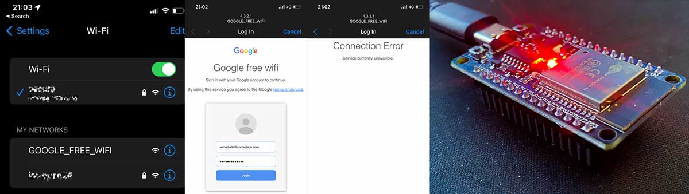

# ESP32 Pen-test Captive Portal
An ESP32 Captive Portal written in Arduino C++ that simulates aa Google Wifi captive portal as part of a phishing attack.

# Why?
I work as a pen-tester for large companies and frequently need to deploy phishing portals to test the efficacy of staff training. Previously I deployed these devices using an array Raspberry Pi Zero 2 W units but the lack of availability, high cost, and high power drain had me wondering if there was a cheaper, readily available and low power alternative.

# Features
- Super cheap, I order my ESP32 WROOM boards from AliExpress for $3.50 each
- Very low power. You can plug these into a USB power bank and expect hours of operation
- Extremely small and easy to hide
- Able to store 100+ credential/password pairs
- Access phished data simply by logging into the portal with an email of your choice (p@t.com by default)

# Issues
The phished credentials are held in RAM, which is limited and lost when the power is cut. This is by design as I don't
want a 3rd party to find the device and have access to any legitimate user credentials. You could save the creds
to a SPIFFS file system if this wasn't an issue https://www.arduino.cc/reference/en/libraries/effortless-spiffs/